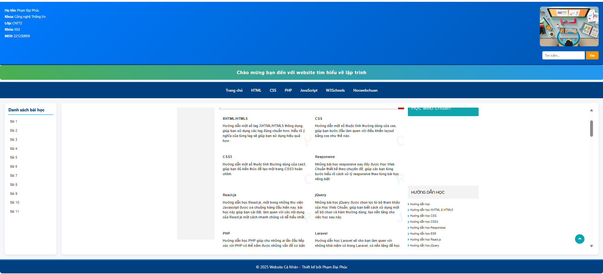

# 🌐 Website Cá Nhân - PHP Thuần

## 📌 Giới thiệu
Dự án **Website Cá Nhân** được xây dựng hoàn toàn bằng **PHP thuần** (không dùng framework), phục vụ cho việc học tập và thực hành.

## ⚡ Tính năng
- 📝 Quản lý và hiển thị các trang bài tập PHP.  
- 🎨 Giao diện HTML + CSS cơ bản.  
- 📂 Cấu trúc thư mục rõ ràng.  

## 🛠️ Công nghệ sử dụng
- 

## 🔧 Công cụ hỗ trợ
- 
- 

## 📂 Cấu trúc thư mục
website_canhan/
├── assets/
│ └── nghichthu/
│ ├── anhchinh.png
│ ├── banner.jpg
│ └── phucdeptrai.html
├── baitap/
│ ├── bai1.php → bai11.php
├── header.php
├── footer.php
├── index.php
└── README.md

## 🚀 Cách chạy dự án
1. Copy project vào thư mục `htdocs` của **XAMPP**.  
2. Khởi động **Apache**.  
3. Truy cập trình duyệt:  

